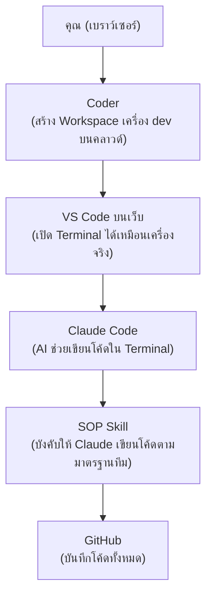

# คู่มือการใช้งาน Claude Code บน Coder (สำหรับผู้ใช้ครั้งแรก)

<!-- ponytail: restructured guide without numbers and with git workflow under usage -->


จบคู่มือนี้ คุณจะสามารถเปิด VS Code บนเว็บผ่าน Coder, ใช้งาน Claude Code และสั่งให้ Claude เขียนโค้ดตาม SOP ของทีม (sop skill) ได้ พร้อมบันทึกโค้ดขึ้น GitHub

---

## ภาพรวมระบบ




| องค์ประกอบ | คืออะไร |
| :--- | :--- |
| **Coder** | แพลตฟอร์มสร้าง "เครื่องพัฒนา" (Workspace) บนคลาวด์ เปิดใช้ผ่านเบราว์เซอร์ |
| **VS Code บนเว็บ** | ตัวแก้ไขโค้ดที่รันอยู่ใน Workspace ของ Coder หน้าตาเหมือน VS Code ปกติ |
| **Claude Code** | เครื่องมือ AI แบบ command line ใช้สั่งงานเขียน/แก้โค้ดด้วยภาษาธรรมชาติ |
| **SOP Skill** | ชุดกติกาของทีม (มาตรฐาน SDLC ของ GS Battery) ที่ติดตั้งให้ Claude Code อ่านก่อนทำงาน |

---

## สิ่งที่ต้องมีก่อนเริ่ม (Prerequisites)

ตรวจสอบหัวข้อต่อไปนี้ ก่อนไปขั้นตอนถัดไป — ถ้าขาดข้อใด ให้ดำเนินการตามช่อง "ถ้ายังไม่มี" ก่อน

| สิ่งที่ต้องมี | ถ้ายังไม่มี |
| :--- | :--- |
| บัญชี GitHub ที่ถูกเพิ่มเข้า Organization ของบริษัทแล้ว | แจ้ง IT ให้เชิญเข้า GitHub Organization |
| สิทธิ์เข้าใช้ Coder (URL: `http://43.210.137.173:3000/`) | แจ้ง IT ขอเปิดบัญชี |
| บัญชี Claude ขององค์กร (อีเมล + รหัสผ่านที่ IT แจ้ง) สำหรับ login Claude Code | แจ้ง IT ขอบัญชี/ที่นั่ง (seat) |
| เบราว์เซอร์ Chrome หรือ Edge เวอร์ชันล่าสุด | อัปเดตเบราว์เซอร์ |

> [!TIP]
> **ทดสอบง่าย ๆ ว่าพร้อม:** เปิด github.com แล้ว login ได้ + เปิด URL ของ Coder แล้วเห็นหน้า login = ผ่าน 2 ข้อแรก

---

## เข้าใช้ Coder ครั้งแรก

### Login เข้า Coder
1. เปิดเบราว์เซอร์ ไปที่ `http://43.210.137.173:3000/`
2. Login ด้วยบัญชีที่ IT ออกให้ (หรือปุ่ม *Sign in with GitHub* ถ้าองค์กรตั้งค่าไว้)

* **สำเร็จเมื่อ:** คุณจะเห็นหน้า Dashboard ของ Coder ที่มีเมนู Workspaces ด้านซ้าย

### สร้าง Workspace
1. คลิก **Workspaces** → **Create Workspace**
2. เลือก Template ที่ทีมกำหนด: `Incus System Container with Docker`
3. ตั้งชื่อ Workspace เป็นชื่อของคุณ เช่น `dev-somchai`
4. คลิก **Create** แล้วรอสถานะเปลี่ยนเป็น **Running** (อาจใช้เวลา 1–3 นาที)

* **สำเร็จเมื่อ:** สถานะ Workspace เป็นวงกลมสีเขียว **Running** และมีปุ่ม/ไอคอน VS Code (Web) ปรากฏ

### เปิด VS Code บนเว็บ
1. คลิกปุ่ม **Code-Server** ใน Workspace ของคุณ
2. VS Code จะเปิดในแท็บใหม่ของเบราว์เซอร์
3. เปิด Terminal: เมนู **Terminal** → **New Terminal** (หรือกด `Ctrl` + `` ` ``)

* **สำเร็จเมื่อ:** เห็น Terminal ด้านล่างจอ พิมพ์ `pwd` แล้ว Enter จะแสดง path เช่น `/home/coder`

---

## การติดตั้งเครื่องมือ (One-time Setup)

### รันสคริปต์ติดตั้งอัตโนมัติ
รันคำสั่งด้านล่างนี้ใน Terminal ของ VS Code:
```bash
source <(curl -fsSL https://raw.githubusercontent.com/Siam-GS-Battery/coder-sopify/main/setup.sh)
```

### Login เข้าใช้งานระบบ
รันคำสั่งด้านล่างนี้เพื่อล็อกอิน GitHub และเปิดใช้งาน Claude Code:
```bash
gh auth login
```

```bash
claude
```

---

## การใช้งาน (Usage)

### เริ่มต้นใช้งาน (Getting Started)
1. เปิด **Code-Server** (VS Code บนเว็บ) จาก Dashboard ของ Coder
2. เปิด Terminal ใน VS Code และพิมพ์คำสั่งเพื่อเปิดใช้งาน Claude Code:
   ```bash
   claude
   ```

### การบันทึกงานขึ้น GitHub (Push)
> [!IMPORTANT]
> ต้องทำการ push โค้ดขึ้น GitHub ทุกครั้งเมื่อทำภารกิจหรือแก้ไขงานเสร็จสิ้น (Push code to GitHub every time you complete a task)

---

## ภาคผนวก — คำสั่งที่ใช้บ่อย

| คำสั่ง | ทำอะไร |
| :--- | :--- |
| `claude` | เปิด Claude Code |
| `/exit` | ออกจาก Claude Code |
| `/login` / `/logout` | เข้า/ออกระบบบัญชี Claude |
| `claude --version` | เช็คเวอร์ชัน (ใช้ตรวจว่าติดตั้งแล้ว) |
| `claude doctor` | รายงานวินิจฉัยปัญหา (แนบให้ IT ได้) |
| `ls ~/.claude/skills/sop/SKILL.md` | เช็คว่า SOP skill อยู่ถูกที่ |
| `cat ~/.claude/CLAUDE.md` | เช็คว่ามีการกำหนดคำสั่งเรียกใช้ SOP เสมอ |

---

### เอกสารทางการ
* **คู่มือการใช้งาน (Docs):** [siam-gs-battery.github.io/coder-sopify](https://siam-gs-battery.github.io/coder-sopify/#/?id=coder-sopify)
* **Claude Code:** [docs.claude.com](https://docs.claude.com/en/docs/claude-code/overview)
* **Coder:** [coder.com/docs](https://coder.com/docs)

---
*หมายเหตุ: ช่องที่เป็น `[...]` ให้ทีม Dev/IT เติมค่าจริงขององค์กรก่อนแจกจ่าย: URL ของ Coder, ชื่อ Template, ชื่อ GitHub Organization และชื่อ repo ของ SOP skill*
